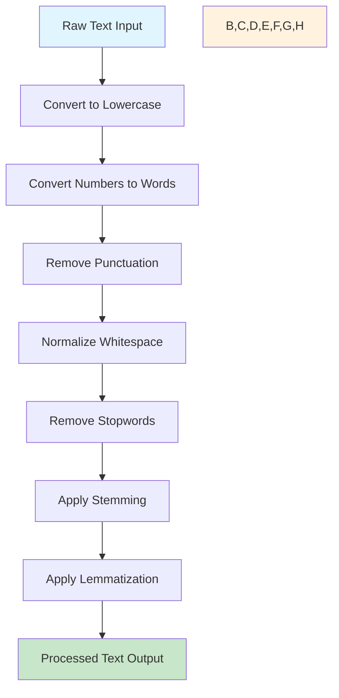

# NLP Text Processing Pipeline

A comprehensive Natural Language Processing pipeline for cleaning and preprocessing textual data, specifically designed for movie review sentiment analysis using the IMDb dataset.

## 🎯 Overview

This project implements a complete NLP preprocessing pipeline that transforms raw text data into clean, structured format ready for machine learning tasks. The pipeline automatically downloads the IMDb movie reviews dataset, applies various text preprocessing techniques, and outputs the processed data for further analysis.

## ✨ Key Features

- **Text Normalization**: Convert text to lowercase for consistency
- **Number Handling**: Convert numeric tokens to words (e.g., "123" → "one hundred twenty-three")  
- **Punctuation Removal**: Clean removal of punctuation marks
- **Whitespace Normalization**: Remove extra spaces and normalize whitespace
- **Stopword Filtering**: Remove common English stopwords using NLTK corpus
- **Stemming**: Reduce words to their root form using Porter Stemmer
- **Lemmatization**: Convert words to their base dictionary form using WordNet
- **Automated Dataset Management**: Seamless download and processing of IMDb datasete

## Overview

The `nlp-pipeline` project provides a simple, end-to-end natural language processing (NLP) workflow for cleaning and preprocessing textual data. It downloads the IMDb movie reviews dataset, applies a customizable text-processing pipeline, and outputs a CSV of processed reviews.

## Features

- Convert text to lowercase
- Convert numeric tokens to words (e.g., “123” → “one hundred twenty-three”)
- Remove punctuation and extra whitespace
- Remove English stopwords
- Apply stemming and lemmatization

## 🔧 Pipeline Architecture

The text processing pipeline follows a sequential approach with the following stages:



## 📋 Prerequisites

- **Python**: Version 3.7 or higher
- **Kaggle API**: Configured credentials for dataset access
- **Internet Connection**: Required for initial NLTK corpus downloads

### Python Dependencies

All required packages are listed in `requirements.txt`:
```
ipykernel
kagglehub  
pandas
nltk
inflect
```

> **Note**: On first run, NLTK will automatically download required corpora (stopwords, punkt, wordnet, punkt_tab).

## 🚀 Quick Start

### 1. Setup Environment

```bash
# Clone the repository
git clone <repository-url>
cd nlp-pipeline

# Create virtual environment (recommended)
python -m venv venv
source venv/bin/activate  # On Windows: venv\Scripts\activate

# Install dependencies
pip install --upgrade pip
pip install -r requirements.txt
```

### 2. Configure Kaggle API

Ensure your Kaggle API credentials are properly configured:
```bash
# Place your kaggle.json file in ~/.kaggle/
mkdir -p ~/.kaggle
cp kaggle.json ~/.kaggle/
chmod 600 ~/.kaggle/kaggle.json
```

For detailed setup instructions, visit the [Kaggle API documentation](https://github.com/Kaggle/kaggle-api).

### 3. Run the Pipeline

```bash
python main.py
```

This will:
1. 📥 Download the IMDb dataset (50K movie reviews) via KaggleHub
2. 🔄 Apply the preprocessing pipeline to each review
3. 📊 Display sample results (original vs. processed text)
4. 💾 Save processed data to `processed_reviews_2.csv`

## 📁 Project Structure

```
nlp-pipeline/
│
├── 📄 main.py                  # Main execution script
├── 🔧 nltk_pipeline.py         # Core NLP preprocessing functions
├── 📋 requirements.txt         # Python dependencies
├── 📖 README.md                # Project documentation
├── 📁 __pycache__/             # Python cache files
│
└── 📊 Generated Files (not in repository):
    ├── processed_reviews.csv      # Previous processing output
    ├── processed_reviews_2.csv    # Latest processing output  
    └── ~/.kaggle/datasets/        # Downloaded IMDb dataset
```

> **⚠️ Important**: Dataset files and processed outputs are **not included** in the repository due to their large size. They will be automatically generated when you run the pipeline.

## 🔍 Example Output

### Before Processing:
```
"This movie was absolutely amazing! I'd rate it 10/10. The cinematography was breathtaking, and the storyline kept me engaged throughout. Highly recommended!!!"
```

### After Processing:
```
['movi', 'absolut', 'amaz', 'rate', 'ten', 'ten', 'cinematographi', 'breathtak', 'storylin', 'kept', 'engag', 'throughout', 'highli', 'recommend']
```

## ⚙️ Customization

The pipeline is modular and can be easily customized. Each processing step is implemented as a separate function in `pipeline.py`:

- `text_to_lowercase()`: Text normalization
- `convert_number()`: Number-to-word conversion
- `remove_punctuation()`: Punctuation cleaning
- `remove_whitespace()`: Whitespace normalization
- `remove_stopwords()`: Stopword filtering
- `stem_text()`: Word stemming
- `lemmatize_text()`: Word lemmatization

You can modify the `pipeline()` function to add, remove, or reorder processing steps based on your specific requirements.

## 🛠️ Technical Details

- **Dataset**: IMDb Movie Reviews (50,000 reviews)
- **Processing Method**: Sequential text transformation pipeline
- **Stemming Algorithm**: Porter Stemmer
- **Lemmatization**: WordNet-based lemmatization
- **Stopwords**: NLTK English stopwords corpus
- **Output Format**: CSV with original and processed text columns

## 🚨 Troubleshooting

### Common Issues:

1. **Kaggle API Error**: Ensure your `kaggle.json` is properly configured and placed in `~/.kaggle/`
2. **NLTK Download Issues**: The script automatically downloads required NLTK data, but you can manually download using:
   ```python
   import nltk
   nltk.download('all')
   ```
3. **Memory Issues**: The IMDb dataset is large (50K reviews). Ensure sufficient RAM or process in smaller batches.

## 🤝 Contributing

Contributions are welcome! Here's how you can help:

1. **Fork** the repository
2. **Create** a feature branch (`git checkout -b feature/amazing-feature`)
3. **Commit** your changes (`git commit -m 'Add amazing feature'`)
4. **Push** to the branch (`git push origin feature/amazing-feature`)
5. **Open** a Pull Request

### Areas for Improvement:
- Add support for other datasets
- Implement batch processing for large datasets
- Add more preprocessing options (entity recognition, POS tagging)
- Create visualization tools for processed data

## 📄 License

This project is licensed under the MIT License - see the [LICENSE](LICENSE) file for details.

## 🙏 Acknowledgments

- **NLTK Team** for the comprehensive natural language processing toolkit
- **Kaggle** for providing the IMDb dataset
- **Contributors** to the open-source libraries used in this project